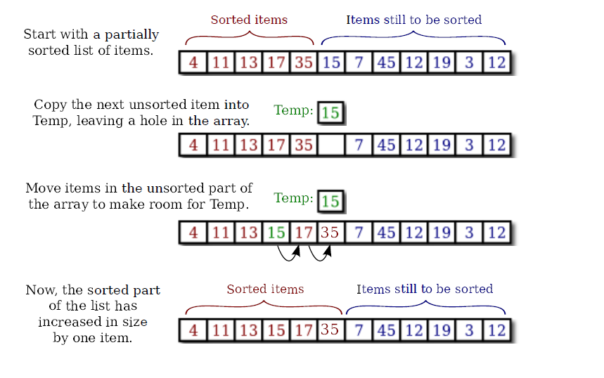

# Ricerca & Ordinamento & Array associativi

---

Vediamo di analizzare il problema della ricerca di un elemento in un array: la **ricerca sequenziale**.

```java
/**
 * Searches the array A for the integer N. If N is not in the array, then -1 is
 * returned. If N is in the array, then the return value is the first integer i
 * that satisfies A[i] == N.
 */
static int find(int[] A, int N) {
	for (int index = 0; index < A.length; index++) {
		if (A[index] == N)
			return index; // N has been found at this index!
	}
	// If we get this far, then N has not been found
	// anywhere in the array. Return a value of -1.
	return -1;
}

```
---
Nella ricerca sequenziale scorro l'array elemento per elemento, e confronto l'elemento dell'array con quello ricercato, finchè non lo trovo (se presente nell'array).

Se l'array fosse già ordinato, potrei essere molto più veloce nella ricerca, eseguendo la **ricerca binaria**.

---

Se l'array di partenza fosse già ordinato, come detto, potrei eseguire la **ricerca binaria**, molto più veloce della sequanziale:

```java
/**
 * Searches the array A for the integer N. Precondition: A must be sorted into
 * increasing order. Postcondition: If N is in the array, then the return value,
 * i, satisfies A[i] == N. If N is not in the array, then the return value is
 * -1.
 */
static int binarySearch(int[] A, int N) {
	int lowestPossibleLoc = 0;
	int highestPossibleLoc = A.length - 1;
	while (highestPossibleLoc >= lowestPossibleLoc) {
		int middle = (lowestPossibleLoc + highestPossibleLoc) / 2;
		if (A[middle] == N) {
			// N has been found at this index!
			return middle;
		} else if (A[middle] > N) {
			// eliminate locations >= middle
			highestPossibleLoc = middle - 1;
		} else {
			// eliminate locations <= middle
			lowestPossibleLoc = middle + 1;
		}
	}
	// At this point, highestPossibleLoc < LowestPossibleLoc,
	// which means that N is known to be not in the array. Return
	// a -1 to indicate that N could not be found in the array.
	return -1;
}

```

---

Come ordinare gli elementi della nostra struttura, ad esempio array di tipi primitivi od oggetti o elementi di un'`ArrayList`?

Vediamo all'inizio semplici algoritmi per farlo, poi le classi che Java mette a disposizione per eseguire gli ordinamenti. 

---
@snap[north-west]
### Insertion sort
@snapend

@snap[west]
Supponiamo di avere una lista ordinata e di voler aggiungere un elemento alla lista. Se si vuole che la nuova lista sia ancora ordinata, allora il nuovo elemento deve essere inserito nel posto giusto (rispetto all'ordinamento), cioè con gli elementi più piccoli messi prima e quelli più grandi messi dopo. Questo vuol dire muovere gli elementi più grandi avanti di un elemento per fare posto al nuovo elemento.
@snapend

---
Qui sotto una illustrazione di un passo durante l'esecuzione dell'insert sort. Questo mostra cosa succede durante una esecuzione del loop for nel metodo sopra, quando itemsSorted è 5:



---
```java
/*
 * Precondition: itemsInArray is the number of items that are stored in A. These
 * items must be in increasing order (A[0] <= A[1] <= ... <= A[itemsInArray-1]).
 * The array size is at least one greater than itemsInArray. Postcondition: The
 * number of items has increased by one, newItem has been added to the array,
 * and all the items in the array are still in increasing order. Note: To
 * complete the process of inserting an item in the array, the variable that
 * counts the number of items in the array must be incremented, after calling
 * this subroutine.
 */
static void insert(int[] A, int itemsInArray, int newItem) {
	int loc = itemsInArray - 1; // Start at the end of the array.
	/*
	 * Move items bigger than newItem up one space; Stop when a smaller item is
	 * encountered or when the beginning of the array (loc == 0) is reached.
	 */
	while (loc >= 0 && A[loc] > newItem) {
		A[loc + 1] = A[loc]; // Bump item from A[loc] up to loc+1.
		loc = loc - 1; // Go on to next location.
	}
	A[loc + 1] = newItem; // Put newItem in last vacated space.
}
```
